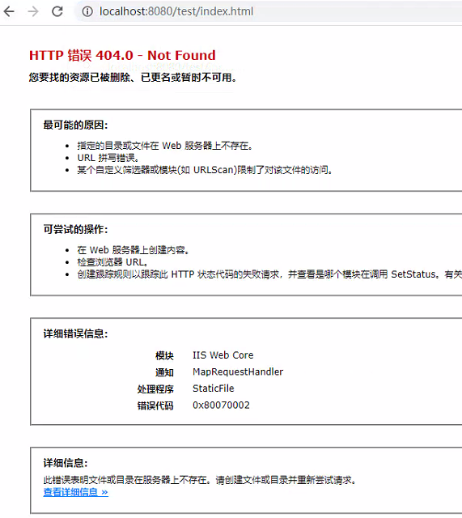

# IIS 的 URL 重写（反向代理）
本人是使用过`nginx`进行代理后端API或者是一些页面地址实现反向代理，但是目前后端使用的是`.NET`，服务器操作是`window`，并且后端项目是基于`IIS`运行的。

## 项目简介
> 打开`localhost:8080/test/index.html`地址实际上访问的内容是来自于`localhost:8070/queryPage`服务端渲染的内容。
> **这里只是用本地地址演示**

**这是没有使用代理前**

**node代码**

**运行环境**
1. 去`web安装平台安装插件：url重写`

2. 安装插件`应用程序请求路由`

安装完成之后在`IIS的主页上`会出现

**注意：如果在IIS主页没有该软件，可以尝试重启IIS，如果还不行可以去官网下载安装**

双击进入
()

需要开启此操作

# 尝试配置
1. 打开我们需要配置的`IIS网站`

2. 创建一个空白规则

3. 填写规则并创建

这里配置完成我们可以测试一下模式

这里可以看到成功进入此条规则

可以看到这里已经保存了，并且成功渲染 。那么这只是最简单的一个例子。
# 条件配置
## {R:N} {C:N} 是什么
> 在刚刚的测试模式当中，可以看到有{R:0}的向后引用，那么这个到底是做什么用的，我们可以测试一下。
> 注意：在模式匹配只能获取到路径（也就是域名后面的那一串），域名或者是参数都需要通过条件来获取。

这里修改下配置，方便服务器获取到`{R:0}`

可以看到`{R:0}`其实就是我们匹配到的东西，那么这是正则对于正则比较熟悉的朋友可以使用()进行分组，这里就不演示了。

**{R:N}是获取模式里面的内容，而{C:N}是用来获取条件里面的内容**

## 条件配置
> 需求：
> API必须带一个url的参数，localhost:8070/queryPage?url=当前页面地址
> 页面访问的地址需要一个pageId参数，localhost:8080/test/index.html?pageId=123
> 那么我们需要获取到页面的域名和query参数
> 最终api的地址应该是 localhost:8070/queryPage?url=localhost:8080/test/index.html?pageId=123

通过`{REQUEST_URL}`的条件来获取路径+参数

通过`{HTTP_HOST}`的条件来获取域名

**注意：如果需要获取条件里面的值，那么一定要勾选条件下面的 `跨条件跟踪捕获组`**
这里可以尝试测试条件，可以看到下面捕获组的`{C:N}`，那么接下来我们就可以操作了。
修改下配置项。

可以看到服务端这边数据没有问题

**注意**

按照我的需求，需要关闭这个。我们可以看下开启访问的URL显示的内容

### 关于条件里面的规则
-   QUERY_STRING 服务器变量所包含的是 page=1&tid=11这部分，表示URL的参数字符串
-   HTTP_HOST 服务器变量所包含的部分是localhost:8080，表示所请求的主机域名
-   SERVER_PORT 服务器变量所包含的部分是 8080，表示服务器的端口
-   SERVER_PORT_SECURE 服务器变量所包含的部分是0，HTTPS请求为OFF，表示接受请求的服务器端口是否为安全端口时，是为1，否则为0，一般来说如果是HTTPS请求则为安全端口，即为1，HTTPS为ON。
-   REQUEST_URI 服务器变量所包含的部分是/test/index.html?page=1&tid=11，就是除了主机域名外剩下的URL地址字符串和参数字符串。

# 操作

这里我演示的是重写，关于重定向是会改变url地址的，所以就不做演示了。

# 如果页面里面有api地址，该如何去代理

这里我用的是相对路径，那么对于客户端使用的是`localhost:8080`打开的页面，但是API是在`localhost:8070`所以肯定是404错误。

## 添加配置

测试

